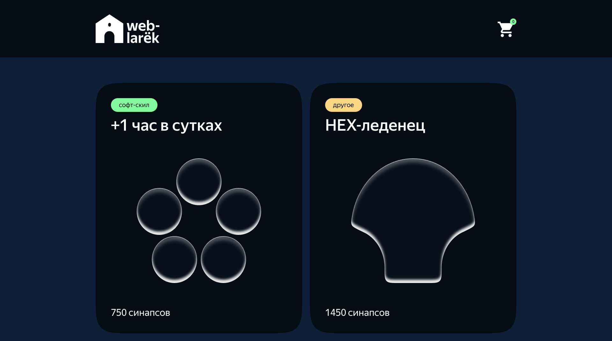
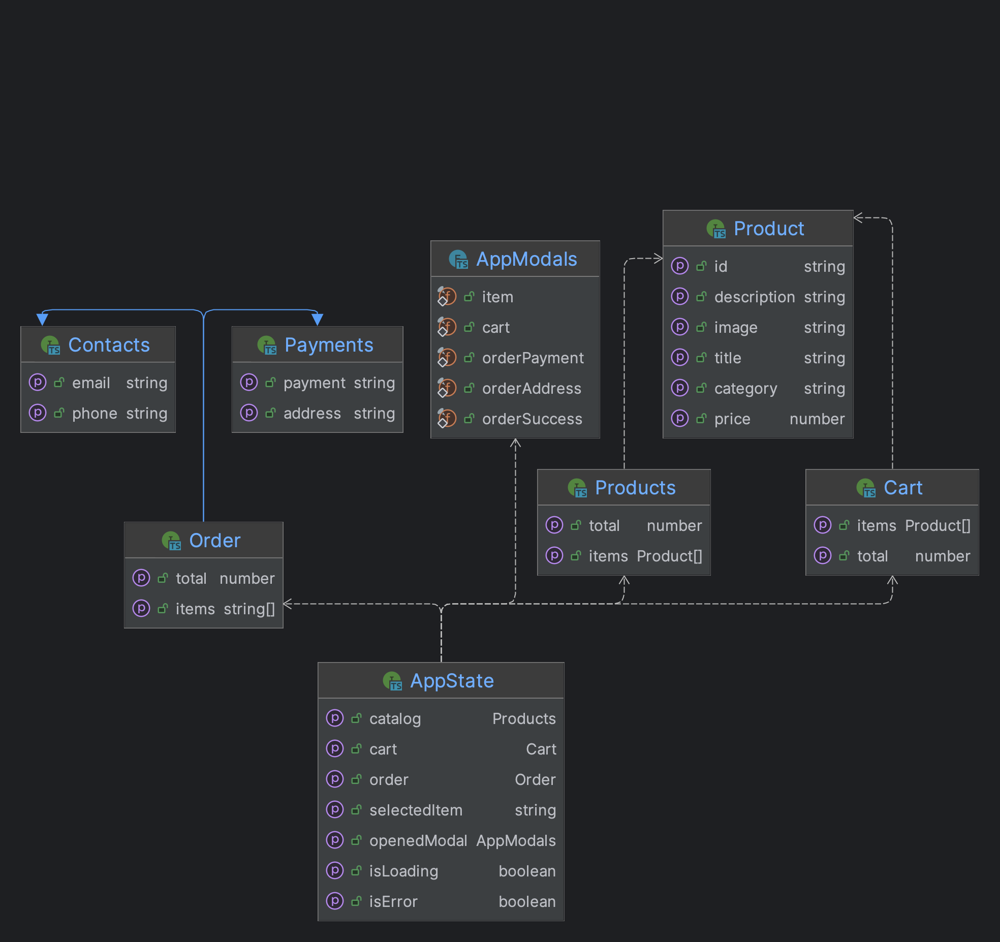

# Проектная работа "Веб-ларек"


## Стек: TypeScript, Webpack

## Структура проекта:
- src/ — исходные файлы проекта
- src/components/ — папка с JS компонентами
- src/components/base/ — папка с базовым кодом

Важные файлы:
- src/pages/index.html — HTML-файл главной страницы
- src/types/index.ts — файл с типами
- src/index.ts — точка входа приложения
- src/styles/styles.scss — корневой файл стилей
- src/utils/constants.ts — файл с константами
- src/utils/utils.ts — файл с утилитами

## Установка и запуск

Для установки и запуска проекта необходимо выполнить команды
```bash
yarn
yarn start
```
## Сборка
```bash
yarn build
```

## Базовые классы

### class Api
Класс для работы с API

#### методы
- handleResponse: Обработчик ответа от сервера
- get: Метод для выполнения GET-запроса
- post: Метод для выполнения POST-запроса

### class EventEmitter
Класс брокера событий

### методы
- on: Устанавливает обработчик на событие.
- off: Снимает обработчик с события.
- emit: Инициирует событие с данными.
- onAll: Подписывается на все события.
- offAll: Сбрасывает все обработчики.
- trigger: Возвращает функцию-триггер, генерирующую событие при вызове.

### class Component
Абстрактный класс отрисовки компонента

## Базовые типы
